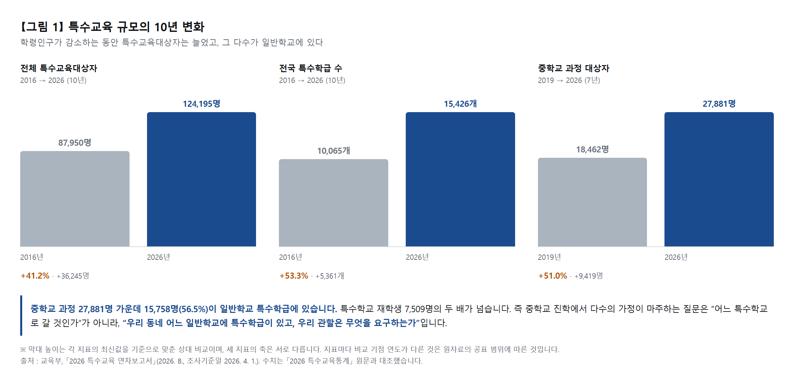
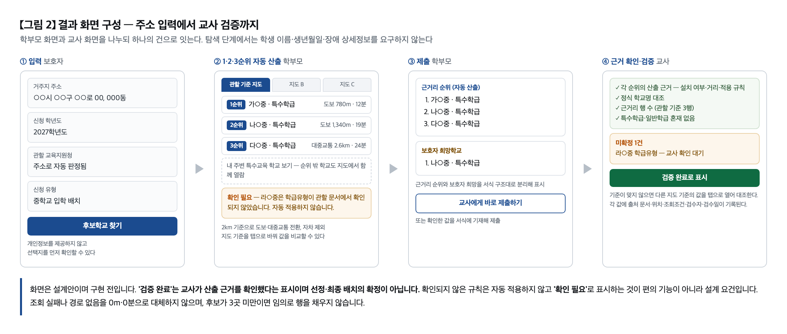
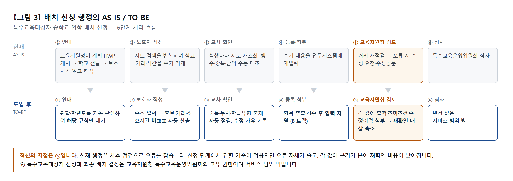

# 2026년 GovTech 창업경진대회 아이디어 기획서

**중입배치 MAP** — 특수교육대상자의 중학교 진학을 위한 후보학교·통학정보 탐색 및 배치 신청자료 작성 지원 서비스

---

> ⚠️ **이 파일은 사본입니다. 정본은 [HWP 제출원고](./HWP_제출원고.txt)입니다.**
> 제출은 한글 파일로 하므로 제출원고가 기준이며, 내용을 고칠 때는 **제출원고를 먼저 고치고 이 파일을 맞춥니다.** 두 파일이 어긋나면 제출원고가 맞습니다.
>
> **문서 성격.** 공식 양식(04_[아이디어_기획서]_2026년_GovTech_창업경진대회_0820_최종.hwp)에 옮겨 적기 위한 **제출본 원고**입니다.
> 작업 이력·근거 대장·내부 검토 메모는 [08 기획서 v0.5](./기획서_v0.5.md)와 [09 선행조사 근거자료](../research/선행조사_근거자료.md)에 남겨 두었습니다.
> 본문 문체는 경어체, 표는 개조식입니다. `[ ]` 표시는 제출 전 채웁니다.

---

## Ⅰ. 참가 개요

### 참가자(팀)명

다온이음 — 다름은 틀림이 아니라는 뜻의 '다온'과, 흩어진 정보와 사람을 잇는다는 '이음'을 합한 이름입니다.

### 세부분야

② 지역·사회문제 해결 (모집공고 예시 '사회적 약자·서비스 접근성')

### 참가작 주제

특수교육대상자의 중학교 진학을 위한 후보학교·통학정보 탐색 및 배치 신청자료 작성 지원 서비스, '중입배치 MAP'

### 참가작 주요내용 요약

**이 서비스의 목표는 어느 관할에 살든, 아이가 다닐 수 있는 중학교를 찾는 일이 보호자와 교사 개인의 몫으로 남지 않게 하는 것입니다. 이미 공개된 자료를 모으는 수고를 본 서비스가 대신하여 특수교육대상자 가정의 서비스 접근성을 높입니다.**

보호자는 어느 학교에 특수학급이 있는지, 근거리 순위와 보호자 희망학교가 어떻게 다른지, 우리 관할이 무엇을 요구하는지를 확인할 창구가 없어 학교와 교사에게 묻습니다. 교사는 학생마다 같은 검색과 검수를 반복합니다. 두 부담은 한 문제의 양면입니다.

2026년 중학교 과정 특수교육대상자 27,881명 가운데 15,758명(56.5%)이 일반학교 특수학급에 있습니다. 그런데 특수학급 15,426개는 학교 단위로 흩어져 있고, 배치 신청 규칙은 176개 교육지원청이 매 학년도 각자 발간합니다.

**중입배치 MAP은 주소만 넣으면 특수학급 설치 중학교 가운데 근거리 1·2·3순위를 자동으로 산출하고, 관할 규칙에 맞춘 거리·소요시간 비교를 제공합니다.**

학부모 화면과 교사 화면으로 나누고 하나의 건으로 이어, 학부모가 만든 건을 교사가 받아 산출 근거를 확인하고 '검증 완료'로 표시합니다. 관할이 기준으로 삼는 지도를 포함해 조회 수단을 탭으로 전환하며 비교할 수 있고, 순위 밖 주변 특수교육 학교도 함께 열람할 수 있습니다. 확인되지 않은 규칙은 자동 적용하지 않고 '확인 필요'로 표시하며, 선정과 최종 배치 결정은 교육지원청 특수교육운영위원회의 고유 권한으로 서비스 범위 밖입니다.

**본 서비스는 공공이 이미 보유하고 공개까지 한 데이터를, 사회적 약자가 실제로 쓸 수 있는 형태로 바꾸어 제공합니다.**

서울 11개 교육지원청의 2027학년도 배치 공고를 이미 전수 대조했고, 공모전 기간에 타 시도로 넓힙니다. 검수가 가능한 한 개 교육지원청을 대상으로 MVP를 구현하고, 교사 검수를 통해 소요시간·수정 건수·기준 일치 여부를 검증하겠습니다.

> ※ 통계 출처 : 교육부, 「2026 특수교육 연차보고서」

---

## Ⅱ. 세부 내용

## 1. 문제 해결의 타당성 〔40점〕

### 1-1. 아이디어에 대한 동기(내·외부적 동기 등) 및 배경 제시 〔25점〕

*— 아이디어 기획의 동기와 배경*

#### 가. 이 기획은 현장의 고민에서 시작했습니다

**이 기획은 현직 특수교사에게서 해마다 되풀이해 들은 중학교 입학 배치 신청 준비 업무에서 시작했습니다.**

오래 교류해 온 현직 특수교사가 있어, 일이 어디에서 막히는지는 일상적인 대화로 늘 들어왔습니다. 한 번 듣고 지나간 이야기가 아니라, 해마다 같은 시기에 같은 대목에서 되풀이되는 이야기였습니다.

듣고만 있지 않은 것은 두 가지 이유에서였습니다. 하나는 안에서 온 것입니다. 반복되는 수작업과 흩어진 정보는 IT 업계에서 일해 온 대표자가 계속 다뤄 온 종류의 문제였고, 막연한 선의가 아니라 해결 방법을 아는 영역이라는 판단이 있었습니다. 다른 하나는 밖에서 온 것입니다. 공공데이터가 개방되고 서비스를 빠르게 만들 수 있는 지금이라면 그 가운데 해결할 수 있는 부분이 있으리라 생각했습니다.

그래서 질문을 하나로 좁혔습니다. 어떤 일이 힘든지가 아니라, 반복과 수작업 때문에 가장 비효율적인 업무가 무엇인지 물었습니다. 교육 자체의 어려움은 기술로 줄일 수 없지만, 반복 검색과 수작업은 줄일 수 있기 때문입니다.

**그 질문에서 나온 답이 바로 그 업무, 중학교 입학 배치 신청 준비였습니다.**

교사가 설명한 내용을 단계별로 정리하면 다음과 같습니다.

**【표 1】 교사가 설명한 배치 신청 준비 업무 (인터뷰 1회차, 이 교사의 경우)**

| 단 계 | 교사가 하는 일 | 반복 단위 |
|---|---|---|
| 학교 검색 | 진학을 준비하는 학생의 거주지 주변 학교를 검색 | 학생마다 |
| 조건 확인 | 특수학급 설치 여부·근거리 순위·거리·통학시간을 확인 | 학교마다 |
| 비교 | 학교를 하나씩 비교해 찾음 — 상당한 시간이 든다고 함 | 학생마다 |
| 신청정보 입력 | 보호자가 수기로 작성한 신청정보를 업무시스템에 직접 타이핑 | 학생마다 |
| 재확인 | 관할 교육지원청의 검토 결과가 다르면 다시 확인해 같은 과정을 반복 | 오류마다 |

다만 처음 들었을 때는 이것이 그 교사 개인의 사정인지, 제도의 구조인지 구분할 수 없었습니다. 그래서 확인하기로 했습니다.

#### 나. 들은 내용을 의심하고, 원문으로 확인했습니다

먼저 2027학년도 실제 계획과 신청서식 3종을 확보해 교사의 설명과 대조했습니다. 이 3종에서 출발해 뒤에 서울 11개 관할 전수로 넓혔습니다 (1-2 표 11).

**【표 2】 처음 확보한 원문 3종**

| 구분 | 문 서 명 |
|---|---|
| D | (동부) 2027학년도 중학교 입학 특수교육대상자 선정·배치 계획 |
| S | (강동송파) 2027학년도 중학교 입학 특수교육대상자 선정·배치 계획 |
| G | (강남서초) 2027학년도 특수학교 신입생 선정 및 배치 계획 — 중학교 입학 대상자용 서식 |

문서가 요구하는 내용은 교사의 설명과 일치했으며, 오히려 더 구체적이었습니다.

- 신청서에 근거리 순위와 보호자 희망학교가 별도 행으로 구성 (이 3종은 근거리 3~4행. 관할별로 3~5행으로 갈리는 것은 전수 대조에서 확인)
- 각 행마다 학급유형·통학방법·통학거리·소요시간을 기재
- 2km를 기준으로 도보와 대중교통을 전환하며 자차는 제외
- 강동송파는 1km 미만 거리를 m 단위 일의 자리까지 기재하도록 하고, 출발지를 아파트 동까지 예시로 명시
- 특수학급과 일반학급은 혼재 기재 불가
- 제출 전 교사가 확인하며, 오류 발생 시 나이스 수정 입력 또는 수정공문이 뒤따름
**여기에서 문제의 성격이 달라졌습니다. 반복 검색은 교사의 업무 습관이 아니라 서식이 요구하는 절차였습니다. 그리고 그 비용은 검색 시간만이 아니라 잘못 기재한 자료의 재작업에도 있었습니다.**

#### 다. 측정된 자료가 없어, 어디가 막히는지를 직접 확인했습니다

다음 질문은 "그래서 무엇이 얼마나 부담인가"였습니다. 그런데 이 구간을 측정한 자료를 찾을 수 없었습니다.

전환기 연구는 대부분 고등학교 이후(대학 진학·취업)에 집중되어 있고, 배치 연구는 특수학교와 특수학급 사이의 선택을 다룹니다. 초등학교에서 중학교로 넘어가는 배치 신청 서류 작성 단계에서 몇 시간이 드는지, 어떤 항목에서 수정이 발생하는지를 측정한 공개 자료는 국가통계에도 선행연구에도 없었습니다.

**자료가 없다는 이유로 이 문제를 추정으로 남겨두지 않았습니다.**

같은 교사를 대상으로 두 번째 인터뷰를 설계했습니다. 이번에는 서식 원문(D·S·G)을 함께 펼쳐 놓고, 문서가 요구하는 항목을 하나씩 짚으며 절차의 어느 지점에서 부담이 생기는지를 확인했습니다.

**이 단계에서 확인한 것은 소요시간의 수치가 아니라 병목의 위치입니다.**

시간과 빈도를 수치로 말하려면 다수의 표본이 필요하고, 표본 1명의 인터뷰로는 확인할 수 없습니다. 수치 확인은 2차 기간의 특수교사 설문 (V3)과 보호자 설문(V4)으로 넘기고, 이 인터뷰에서는 어디가 막히는지를 특정하는 데 집중했습니다.

**【표 3】 현직 특수교사 심층 인터뷰 (대표자 직접 수행, 표본 1명)**

| 회차 | 성격 | 확인한 것 |
|---|---|---|
| 1회차 | 탐색 | "가장 비효율적인 업무"를 한정해 질문 → 중입 배치 신청 준비 업무 식별, 단계별 작업 순서 확보 |
| 2회차 | 구조화 | 서식 원문을 대조하며 항목별 확인 → 절차상 병목 지점을 특정. 수치가 아니라 위치를 확인 |

**가장 부담이 큰 지점은 근거리 1·2·3순위를 둘러싼 왕복이었습니다.**

교사가 학부모에게 순위의 의미와 기재 방법을 설명하고, 학부모가 작성해 제출합니다. 그런데 하나의 신청서 안에 여러 제도의 요건이 겹쳐 있어 제출 뒤에 수정 요청이 뒤따르고, 그 수정을 다시 설명하고 다시 받는 과정이 반복됩니다.

- 설명 — 근거리 순위와 보호자 희망학교의 차이, 관할이 요구하는 기재 방법을 학부모에게 설명합니다.
- 작성·제출 — 학부모가 작성해 제출합니다.
- 수정 요청 — 요건에 맞지 않으면 수정을 요청하고 같은 설명을 다시 합니다. 나이스 수정 입력이나 수정공문이 뒤따르기도 합니다.
**이 왕복은 교사만의 일이 아닙니다. 학부모와 교사가 함께 짊어지는 부담입니다.**

학부모는 무엇이 왜 맞지 않는지 모르는 채 다시 작성하고, 교사는 같은 설명을 담당 학생 수만큼 반복합니다. 이 교사는 해당 업무를 한 해 업무 가운데 가장 스트레스가 큰 일로 꼽았습니다.

**수정 절차가 뒤따른다는 사실은 인터뷰만의 진술이 아닙니다. 서식 원문이 이 사후 절차를 직접 명시하고 있습니다.**

문서가 오류를 전제하고 절차를 미리 마련해 두었다는 사실 자체가, 인터뷰와 독립된 두 번째 근거입니다. 재작업 비용은 예외 상황이 아니라 제도가 이미 예상하고 있는 일입니다.

> ※ 다만 이것은 표본 1명의 사례입니다. 본 기획서는 이 내용을 전국 평균이나 오류율로 제시하지 않습니다. "이 교사의 경우 이러했다"는 범위에서만 사용하며, 다수 응답으로 확장하는 일은 2차 기간 특수교사 설문(V3)과 보호자 설문(V4)의 과제로 둡니다. 여기에서 특정한 병목은 그 설문의 문항을 설계하는 기준이 됩니다.

#### 라. 교사 1,082명 조사에서도 39.0%가 같은 요구를 말합니다

교사 한 명의 경험을 전체 현장의 일로 확대해도 되는지 확인이 필요했습니다. 그래서 특수교사 대상 조사를 찾아보았습니다.

전국특수교사노동조합이 2026년 5월 발표한 설문 「우리가 설계하는 2026년 특수교육」은 응답자 1,082명 중 69.9%가 초등 특수교사, 81.1%가 특수학급 근무 교사였습니다. 본 서비스가 대상으로 하는 집단과 사실상 같은 구성입니다.

**【표 4】 특수교사가 꼽은 시급한 현안 (복수응답, n=1,082)**

| 현 안 | 응답률 | 성 격 |
|---|---|---|
| 과밀학급 해소 및 특수학교(급) 확충 | 64.8% | 예산·시설 |
| 특수교육법 개정을 통한 학급당 학생 수 감축 | 55.4% | 법 개정 |
| 일방적 특수학급 전일 분리 금지 | 48.2% | 제도 |
| 특수교사 행정업무 경감 및 행정지원 체계 구축 | 39.0% | 도구로 접근 가능 |

**앞의 세 항목은 법 개정과 예산이 필요한 사안입니다. 네 번째 항목은 도구로 접근할 수 있는 영역이며, 본 과제가 놓인 자리입니다.**

특수교육대상자는 2021년 98,154명에서 2026년 124,195명으로 5년 사이 26,041명 늘었습니다. 업무 수요가 커지는 만큼 인력·제도 개선과 함께 반복 행정을 줄이는 도구 지원이 필요합니다.

> ※ 이 39.0%는 행정업무 전반에 대한 응답이며, 중학교 입학 배치 서류 작성이 그중 얼마를 차지하는지는 이 조사로 알 수 없습니다. 해당 비중은 2차 기간 특수교사 설문(V3)으로 직접 확인하겠습니다.

국립특수교육원 「특수교육연구」에 실린 특수교사 직무 스트레스 연구(면담 10명의 질적연구)에서는 과중한 행정업무를 혼자 처리하는 상황이 주요 스트레스 요인으로 보고되었으며, 한 교사는 자신의 상태를 "매년 학기를 시작할 때마다 신규 같다"고 표현했습니다.

**계획과 서식이 매 학년도 새로 발간되고 관할마다 다르다는 조건은, 이 '매년 신규 같은' 상태를 만드는 요인 중 하나입니다.**

본 서비스가 규칙을 버전으로 관리하여 축적하려는 이유가 여기에 있습니다.

#### 마. 교사만의 문제가 아니라, 학부모의 문제이기도 합니다

교사의 설명 중 두 대목이 계속 마음에 남았습니다. "보호자가 수기로 써 온 신청정보를 시스템에 다시 입력한다"와 "학부모가 어느 학교에 특수학급이 있는지 물어본다"였습니다.

이 둘은 교사의 업무 목록처럼 들리지만, 실제로는 학부모 쪽 사정을 가리킵니다. 학부모가 이해할 수 있는 형태로 제도와 절차가 놓여 있었다면 묻지 않았을 것이고, 교사가 재확인할 일도, 같은 설명을 몇 번이나 반복할 이유도 없었을 것입니다.

**제도가 어려운 것이 아니라, 그 제도를 학부모에게 쉽게 설명해 줄 도구나 서비스가 없다는 것이 문제입니다.**

**【표 5】 같은 문제의 양면**

| 구 분 | 학부모 | 초등 특수교사 |
|---|---|---|
| 겪는 빈도 | 대개 평생 한 번 | 매 학년도, 담당 학생 수만큼 |
| 아는 정도 | 처음. 용어부터 낯섦 | 숙련되나 관할 규칙은 매년 변경 |
| 모르는 것 | 특수학급 설치 학교, 근거리와 보호자 희망의 차이, 우리 관할의 조항 유무 | 학생별 거리·소요시간을 매번 재조회해야 함 |
| 대응 | 학교와 교사에게 문의 | 문의를 받으면 학생 수만큼 대신 확인 |
| 결과 | 준비 부담. 오류 시 재작성 | 반복 확인. 오류 시 수정 입력·수정공문 |

**교사의 반복 업무는 학부모가 혼자 할 수 없기 때문에 발생합니다. 두 부담은 한 문제의 양면입니다.**

한쪽만 도우면 부담이 옮겨갈 뿐입니다. 학부모용 탐색 도구만 만들면 교사의 검수 책임은 그대로 남고, 교사용 도구만 만들면 학부모는 여전히 모르는 상태로 문의해야 합니다. 그래서 본 서비스는 같은 건을 학부모가 작성하고 교사가 이어받는 인계 흐름을 설계 단계에서부터 반영했습니다.

#### 바. 기술로 해결 가능한 문제인지, 데이터로 확인했습니다

기획서를 작성하기에 앞서 먼저 확인했습니다. 해결할 수 없는 문제라면 제안할 이유가 없기 때문입니다.

**학교 기본정보 공공 API를 직접 호출해 주소만으로 관할을 자동 판정할 수 있음을 확인했고, 타 지역 공개 서식을 실제로 내려받아 본문 추출까지 확인했습니다.**

사용자가 자기 관할을 몰라도 서비스가 판정할 수 있다는 뜻이고, 관할 문서를 기계로 읽어 규칙을 뽑을 수 있다는 뜻입니다. 확인 항목과 검증 수준은 2-1의 【표 13】에 정리했습니다.

#### 사. 문제는 제도가 아니라, 제도를 활용할 도구입니다

조사 과정에서 확인한 국가승인통계는 분명했습니다. 선정·배치 제도에 대한 보호자 만족도는 만족 이상 70.9%, 불만족 이하 5.1%입니다(1-2 참조).

**제도는 이미 다수 보호자에게 신뢰받고 있습니다. 부담은 제도가 아니라 그 제도를 통과하는 과정에 있습니다.**

규칙은 공개되어 있지만 관할마다 흩어져 있고, 그것을 각 가정의 사정에 대입해 읽어 줄 도구가 없습니다. 본 과제의 정의를 여기에 맞췄습니다.

> ※ 조사 결과에 따라 조정한 전제와 그 반영 결과는 4-1의 【표 29】에 정리했습니다.

#### 아. 그래서 이 문제를 선택했습니다

- 개인의 사정이 아니라 구조의 문제입니다. 서식이 요구하고, 관할마다 따로 존재하며, 매년 새로 발간됩니다.
- 다수가 겪는 문제입니다. 중학교 과정 특수교육대상자의 절반 이상이 일반학교 특수학급에 재학하고 있습니다.
- 해결 가능한 문제입니다. 필요한 데이터의 확보 경로를 기획 단계에서 직접 확인했습니다.
### 1-2. 아이디어의 필요성 및 사회적 이슈와의 관련성 〔15점〕

*— 문제 해결의 필요성과 사회적 공감대*

#### 가. 통합교육은 예외가 아니라 표준입니다

**【그림 1】 특수교육 규모의 10년 변화**

**【표 6】 특수교육 규모 (교육부 「2026 특수교육 연차보고서」, 조사기준일 2026.4.1)**

| 지 표 | 2026년 | 비 고 |
|---|---|---|
| 전체 특수교육대상자 | 124,195명 | 2016년 87,950명 → 10년간 +41.2% |
| 일반학교 배치 | 91,986명 (74.1%) | 특수학급 72,784명(58.6%) + 일반학급 19,202명(15.5%) |
| 특수학교 배치 | 31,993명 (25.8%) |
| 전국 특수학급 수 | 15,426개 | 2016년 10,065개 → +53.3% |

학령인구가 감소하는 동안 특수교육대상자는 10년 사이 41.2% 증가했고, 그중 4분의 3이 일반학교에 재학합니다.

**특수교육은 별도의 공간에서 이루어지는 예외적 사안이 아니라, 전국 일반학교에 분산된 일상 행정이 되었습니다.**

학교급을 중학교로 좁히면 구조가 더욱 뚜렷해집니다.

중학교 과정 27,881명의 배치는 일반학교 특수학급 15,758명(56.5%), 특수학교 7,509명(26.9%), 일반학교 일반학급 4,614명(16.6%)입니다. 특수학급 인원이 특수학교의 두 배를 넘습니다.

즉 매년 중학교 진학을 준비하는 다수의 가정에게 실제 질문은 다음과 같습니다.

**"우리 동네 어느 일반학교에 특수학급이 있고, 우리 관할은 무엇을 어떻게 작성하라고 하는가?"**

#### 나. 통학은 상당수 가정에서 부모가 매일 감당하는 일입니다

신청서가 통학거리와 소요시간을 요구하는 이유는, 그 값이 한 가정이 매일 감당할 시간의 크기이기 때문입니다. 국가승인통계가 이를 보여줍니다.

**【표 7】 혼자 통학 가능 여부 (중학교 과정 23,002명, 표 Ⅰ-12)**

| 구 분 | 인 원 | 비 율 |
|---|---|---|
| 혼자 통학 가능 | 12,616명 | 54.8% |
| 혼자 통학 가능하지 않음 | 10,386명 | 45.2% |

혼자 통학할 수 없는 중학생 10,386명의 등·하교를 누가 돕는지를 보면 문제의 성격이 분명해집니다.

**【표 8】 등·하교 주 보조자 (중학교 과정, 표 Ⅰ-13)**

| 보조자 | 인 원 | 비 율 |
|---|---|---|
| 어머니 | 5,805명 | 55.9% |
| 아버지 | 670명 | 6.4% |
| 활동보조인 | 2,757명 | 26.5% |
| 조부모 | 453명 | 4.4% |

> ※ 출처 : 국립특수교육원, 「2023 특수교육 실태조사」. 보호자 응답.

**어머니 55.9%와 아버지 6.4%를 합하면 62.3%입니다.**

혼자 통학할 수 없는 중학생 열 명 중 여섯 명 이상은 부모가 직접 등·하교를 함께합니다. 일반학교 특수학급으로 좁히면 이 비율은 74.4%로 더 올라갑니다.

**그러므로 통학거리는 서식의 기재 항목이 아니라, 가정의 일상 조건입니다.**

어느 학교를 쓰느냐에 따라 부모의 하루가 달라집니다. 제도는 이 점을 이미 알고 있어서, 근거리 순위를 거리 기준으로 엄격하게 정하도록 하고 있습니다. 선정·배치에 대한 보호자 만족도가 낮지 않은 이유이기도 합니다(마. 참조).

**다만 그렇기 때문에 신청서는 보호자가 원하는 대로가 아니라, 제도가 정한 기준대로 작성해야 합니다.**

그 기준에 맞는 값을 신청 전에 정확히 비교할 수 있어야 하는 이유가 여기에 있습니다.

정보를 찾고 서류를 준비하는 일을 대신해 줄 사람도 사실상 부모입니다. 특수교육대상 중학생의 일상생활을 주로 돕는 사람은 84.5%가 가족이며 (표 Ⅰ-89), 발달장애인의 주 돌봄자는 78.6%가 부모(모 66.2%·부 12.4%), 평균 연령은 56.6세입니다(보건복지부, 2021년 발달장애인 실태조사).

#### 다. 학부모는 언제나 처음입니다

학부모가 이 절차를 겪는 것은 대개 평생 한 번이고, 그 한 번이 아이가 3년을 보낼 학교를 결정합니다.

**실제로 중학교 과정 특수교육대상자의 19.8%(4,546명)는 중학교에 들어와서 처음 특수교육대상자로 선정됐습니다.**

중학교 1학년 9.3%와 2~3학년 10.5%를 합한 값입니다(표 Ⅰ-5). 이 가정들에게 배치 절차는 말 그대로 처음 겪는 일입니다.

구조적으로도 불리합니다. 반복 학습이 불가능하고, 규칙은 매년 바뀌며, 이사하면 관할이 달라져 처음부터 다시 확인해야 합니다. 증빙은 여러 기관에 걸쳐 있어 선정 결과통지서·장애등록 정보·주민등록등본을 함께 준비해야 하고, 교사는 그 서류 사이의 차이까지 확인합니다. 그런데 문의할 곳이 사실상 학교뿐입니다. 통합된 안내 창구가 없습니다.

**확인할 방법이 없다는 사실 자체가 부담입니다.**

아이의 진학을 결정하면서 무엇이 맞는지 모르는 상태로 서류를 작성하는 일은, 시간의 문제이기에 앞서 확신의 문제입니다.

이는 개인이 알아서 감당할 사안도 아닙니다. 「장애인 등에 대한 특수교육법」 제13조 및 시행령 제8조는 3년 주기 특수교육 실태조사를 규정하고 있으며, 그 조사 항목에는 보호자의 만족도와 요구사항이, 조사 목적에는 특수교육 대상자 배치계획 수립이 명시되어 있습니다.

**보호자가 배치 과정에서 무엇을 필요로 하는지는 국가가 정기적으로 확인하도록 법에 규정된 사안입니다.**

#### 라. 정보는 제도보다 입소문으로 흐릅니다

같은 조사에서 정보접근 지원의 현황은 다음과 같습니다.

- 중학교 과정에서 현재 지원을 받고 있는 비율 : 0.8% (192명)
- 향후 필요하다는 응답 : 6.0% (1,383명)
- 필요가 실제 제공의 7.5배이며, 제공률은 9개 관련서비스 중 가장 낮고 필요 응답은 전 학교급 중 중학교가 가장 높습니다. (표 Ⅰ-149, Ⅰ-165)
> ※ 이 문항의 '정보접근 지원'에는 점자·음성 등 장애 특성상의 정보 접근이 포함될 수 있어, 진학 정보 안내만을 가리킨다고 단정하지 않습니다.

국립특수교육원 「2023 특수교육 실태조사」(국가승인통계 제112014호)의 장애영아 보호자 406명 응답에서는 경로가 더 분명히 드러납니다.

- 자녀가 다니는 기관을 알게 된 계기 : 주변 사람의 안내 41.6%, 교육청·특수교육지원센터 안내 19.2% (표 Ⅱ-7)
- 선정·배치에서 어려움을 겪었다고 응답한 252명 가운데 40.1%가 '정보 안내 부족'을 첫 번째 이유로 지목 (표 Ⅱ-10)
**공식 안내보다 입소문이 두 배 이상입니다. 정보가 제도가 아니라 인맥과 검색으로 흐릅니다.**

아는 사람이 있는 가정과 없는 가정 사이에 격차가 생기는 지점이 바로 여기입니다.

> ※ 다만 이 두 수치는 장애영아 보호자 조사이며 중학교 진학 단계가 아닙니다. 같은 제도의 다른 입구에서 확인된 패턴으로만 제시하며, 중입 단계에 그대로 적용하지 않습니다.

#### 마. 제도가 불만족스러운 것이 아닙니다 — 문제는 다른 자리에 있습니다

선정·배치 제도 자체에 대한 보호자 만족도는 낮지 않습니다.

**【표 9】 특수교육대상자 선정·배치 만족도 (보호자 104,087명, 표 Ⅰ-187)**

| 응 답 | 비 율 |
|---|---|
| 매우 만족 | 25.9% |
| 만족 | 45.0% |
| 보통 | 24.0% |
| 불만족 | 3.8% |
| 매우 불만족 | 1.3% |

**만족 이상 70.9%, 불만족 이하 5.1%.**

**따라서 본 과제는 제도 개선을 주장하지 않습니다. 선정·배치 제도는 이미 다수 보호자에게 신뢰받고 있습니다.**

다만 한 가지가 눈에 띕니다. '매우 만족' 비율이 학교급이 올라갈수록 단조 감소합니다. 유치원 35.8% → 초등 27.2% → 중학교 23.8% → 고등 21.0%. 상급 학교로 갈수록 만족의 강도가 옅어집니다.

**본 서비스가 놓인 자리는 여기입니다. 만족하는 제도를, 더 적은 부담으로 통과하게 하는 일.**

제도를 바꾸지 않고, 그 제도를 거치는 과정의 시간과 불확실성을 줄입니다.

#### 바. 그 답이 흩어져 있습니다

**【표 10】 정보가 흩어져 있는 네 지점**

| 흩어진 지점 | 확인된 사실 |
|---|---|
| 학교 | 특수학급 15,426개가 개별 학교 단위로 분산. 설치 여부는 공시자료로 도출할 수 있으나 학급유형은 관할 문서에만 있음 |
| 관할 | 전국 교육지원청 176개가 각자 계획·서식 발간 |
| 연도 | 계획은 매 학년도 새로 발간. 신설·증설 예정 학교가 별도 표기됨 |
| 규칙 | 근거리 행 수, 보호자 희망 행, 출발지, 거리 표기 단위가 관할마다 다르게 기재. 서울 11개 관할 전수 확인 |

2026. 9. 20. 서울 11개 교육지원청의 「2027학년도 중학교 입학 특수교육대상자 선정·배치 계획」 원문 전부를 확보해 조항 단위로 대조했습니다. 표본이 아니라 서울 전 관할 전수입니다.

**같은 서울시교육청 공통 서식 안에서도, 신청서에 적어야 하는 근거리 학교 수가 관할마다 3개·4개·5개로 갈립니다.**

**【표 11】 서울 11개 관할 규칙 대조 (전수, 2026. 9. 20. 확보)**

| 관할 | 근거리 기재 행 수 | 보호자 희망 행 | 출발지 기재 | 거리 표기 단위 |
|---|---|---|---|---|
| 동부 | 3 | 있음 | 주민등록상 거주지 | 규정 없음 |
| 서부 | 5 | 있음 | 주민등록상 거주지 | 규정 없음 |
| 남부 | 3 | 있음 | 주민등록상 거주지 | 규정 없음 |
| 북부 | 3 | 없음 | 주민등록상 거주지 | 규정 없음 |
| 중부 | 3 | 1·2·3순위 | 주민등록상 거주지 | 규정 없음 |
| 강남서초 | 4 | 있음 | 주민등록상 거주지 | 규정 없음 |
| 강동송파 | 3 | 있음 | 아파트 동까지 명시 | 1km 미만 m 일의 자리 |
| 강서양천 | 5 | 있음 | 주민등록상 거주지 | 규정 없음 |
| 성동광진 | 5 | 있음 | 주민등록상 거주지 | 규정 없음 |
| 성북강북 | 4 | 있음 | 주민등록상 거주지 | 규정 없음 |
| 동작관악 | 3주1) | 있음 | 주민등록상 거주지 | 규정 없음 |

> ※ 기준 지도는 11개 관할 모두 카카오맵으로 동일합니다. 형제·자매 특이배치 조항도 11개 관할 모두에 있습니다.

- 관할이 스스로 적어 둔 개정 이력도 확보했습니다. 서부가 함께 배포한 신·구 대조표는 2026학년도의 '포털사이트 지도'를 2027학년도에 '카카오맵 지도'로 바꾼 사유를 "대중교통 거리(km) 산출 기능이 있는 포털사이트 명시하여 기준 명확화 — 네이버 지도: X, 카카오맵: O"로 기재했습니다.
- 확정하지 못한 것도 함께 밝힙니다. 강동송파·성북강북·동작관악은 서식의 표와 작성 방법이 서로 다른 개수를 지시하고, 거주지 관할과 희망 학교 관할이 다를 때 어느 규칙을 따르는지는 11개 문서에 없습니다. 미확정 규칙은 자동 적용하지 않는 것이 설계 원칙입니다.
- 서울 밖에서도 같은 축으로 갈리는지는 2-1 검증 로드맵 V1'에 두었습니다.
주1) 동작관악은 서식 표에 근거리 3행이 있으나 작성 방법은 5개를 지시합니다.

**한 번뿐인 경험을, 매년 바뀌는 규칙 아래에서, 각 가정이 개별적으로 감당하고 있습니다.**

#### 사. 사회적 의미 — 이것이 GovTech 과제인 이유

특수교육대상자의 진학 정보 접근성은 「장애인 등에 대한 특수교육법」이 보장하는 교육권의 실질적 전제입니다.

**정보를 먼저 찾아낼 수 있는 가정과 그렇지 못한 가정 사이의 격차는 곧 선택지의 격차가 됩니다.**

정보 탐색 역량은 가정마다 다르며, 그 차이가 아이의 통학 조건으로 이어진다면 이는 개인이 감당할 문제가 아니라 제도가 메워야 할 격차입니다.

그리고 이 격차는 데이터가 없어서 발생한 것이 아닙니다.

**【표 12】 이미 공개되어 있으나 국민이 활용할 수 없는 데이터**

| 이미 공개되어 있는 것 | 그런데 국민이 활용할 수 없는 이유 |
|---|---|
| 전국 학교 위치·좌표 표준데이터 | 특수학급 설치 여부와 연결되어 있지 않음 |
| 학교 기본정보 공공 API | 일반 국민이 직접 호출해 사용하는 형태가 아님 |
| 학교알리미 공시정보 | 설치 여부는 도출되지만 학급유형이 없고, 기준일이 4월 1일이라 신청 시기와 시차가 있음 |
| 교육지원청별 배치계획·서식 | 176개 관할의 HWP 문서로 분산 |
| 중학교 학구·학군 공간정보 | 별도 서비스로 분리 |
| 교육부 특수교육정보 특수학급 현황 | 기준일 2016년 4월 1일에서 갱신이 멈춤 |
| 교육부 특수교육 통계 | 교육지원청 단위 집계만 제공. 학교별이 아님 |

**공공이 이미 보유한 데이터를 국민이 실제로 활용할 수 있는 형태로 전환하는 일, 그리하여 행정의 효율과 국민의 편익이 동시에 개선되는 일.**

이것이 본 과제의 성격이며, 모집공고의 세부분야 '사회적 약자·서비스 접근성'과 직접 연결됩니다.

## 2. 사업화 가능성 〔30점〕

### 2-1. 구체적 실행계획 및 기술적 실현 가능성 〔20점〕

**【그림 2】 결과 화면 구성 — 주소 입력에서 교사 검증까지**

**만들 화면은 이렇습니다. 아래는 그 화면을 뒷받침하는 데이터·기술 근거입니다.**

#### 가. 서비스 구성 — 학부모 화면과 교사 화면을 나누고 한 건으로 잇습니다

같은 신청 건을 학부모가 작성하고 교사가 이어받습니다. 그래서 두 사람이 보는 화면을 나누되, 하나의 건으로 연결했습니다.

- 학부모 화면 (모바일·웹) 주소만 넣으면 후보학교와 순위를 확인할 수 있는 간단한 탐색 화면입니다.
- 교사 화면 (웹) 학부모가 보낸 건의 산출 근거를 확인하고 검증 상태를 남기는 화면입니다.
처리 흐름은 다음과 같습니다.

① 주소 입력 학부모가 거주지 주소와 신청 학년도를 넣습니다. 관할 교육지원청은 주소로 자동 판정합니다. 이 단계에서는 학생 이름·생년월일·장애 상세정보를 요구하지 않습니다. ② 근거리 1·2·3순위 자동 산출 특수학급 설치 여부와 거리를 기준으로 근거리 1·2·3순위를 산출합니다. 순위 판정에 필요한 최소 데이터만 사용합니다. ③ 내 주변 특수교육 학교 보기 순위에 들지 않은 주변 학교도 지도에서 함께 보여 주고, 학교별 관련 정보를 제공합니다. 순위 산출과는 분리된 열람 기능입니다. ④ 지도 기준 전환 관할이 기준으로 삼는 지도를 포함해 조회 수단을 탭으로 제공합니다. 같은 학교라도 기준에 따라 거리·소요시간이 달라지므로, 어떤 기준의 값인지를 함께 표기하고 직접 비교할 수 있게 합니다. ⑤ 제출 학부모는 두 가지 가운데 하나를 고릅니다.

  - 산출된 1·2·3순위를 확인해 서식에 기재하고 제출합니다.
  - 또는 '교사에게 바로 제출하기'로 같은 건을 교사에게 넘깁니다. ⑥ 교사 검증 교사는 각 순위가 어떤 데이터와 규칙으로 산출됐는지 근거를 확인하고 '검증 완료'로 표시합니다. 기준이 맞지 않으면 다른 지도 기준의 값을 탭으로 열어 대조합니다.
**이 흐름이 겨냥하는 것은 제출 뒤에 반복되던 설명과 수정의 왕복입니다.**

지금은 학부모가 제출한 뒤에야 요건 불일치가 드러나고, 그때부터 설명과 재작성이 다시 시작됩니다(1-1 다. 참조). 순위와 그 산출 근거를 같은 화면에서 함께 보고 제출 전에 검증까지 마치면, 그 왕복을 뒤가 아니라 앞에서 처리하게 됩니다.

> ※ '검증 완료'는 교사가 서비스 안에서 산출 근거를 확인했다는 표시이며, 선정·최종 배치의 확정이 아닙니다. 선정과 배치 결정은 교육지원청 특수교육운영위원회의 고유 권한으로 본 서비스의 범위 밖입니다.

#### 나. 기술 검증 결과 — 기획 단계에서 실행으로 확인한 사항

개발자와 서비스 범위를 협의하여 개발 가능 의견을 확인했으며, 그와 별개로 핵심 데이터의 확보 가능성을 직접 확인했습니다.

**【표 13】 데이터 확보 가능성 검증 결과**

| 항 목 | 확인 결과 | 검증 수준 |
|---|---|---|
| 학교 기본정보 | 공공 API 실호출 성공. 학교코드·정식명칭·관할 교육지원청명·도로명주소·남녀공학 구분 반환. 주소만으로 관할 자동 판정 가능 | 실행 검증 |
| 학교 좌표 | 전국초중등학교위치표준데이터에 위도·경도와 교육지원청코드 포함 | 명세 확인 |
| 중학구 경계 | 전국중학교학교군표준데이터를 API와 파일로 개방. 운영기관 한국교육시설안전원, 최신본 2026.3.20 | 명세 확인 |
| 주소 정규화·지오코딩 | 도로명주소 API로 입력 정규화, 카카오 로컬로 좌표 산출, VWorld 폴백. 모두 무료 | 명세 확인 |
| 경로 조회 | 도보 TMAP 보행자, 대중교통 ODsay. 제휴 없이 키 발급만으로 시작 가능 | 명세 확인 |
| 특수학급 설치 여부 | 학교알리미 공시정보로 전국 범위 도출 가능. 단 학급유형은 미포함 | 명세 확인 |
| 지역 서식 확보 | 타 시도 공개 계획 파일 실제 다운로드 및 본문 텍스트 추출 성공 | 실행 검증 |
| 기계판독 학교현황 | 복수 교육지원청이 학교(급) 현황을 표 파일로 첨부 | 첨부 확인 |

#### 다. 구현 범위를 좁혀 실현 가능성을 높였습니다

현장 확인 결과 배치 신청서 작성 단계에서는 학교 인원을 기재하거나 확인하지 않는다는 점을 파악했습니다. 이에 따라 서비스가 유지해야 할 데이터는 네 가지로 줄었습니다.

**학교코드 · 학년도 · 특수학급 설치 여부 · 학급유형**

학급수·재적수·정원·잔여석은 MVP 대상이 아닙니다. 이 범위 축소가 데이터 조달 난이도를 실질적으로 낮춘 판단이며, 필요한 네 항목은 교육지원청이 매년 공개하는 배치계획 '참고1 학교 현황'에 그대로 수록되어 있습니다.

네 항목을 공개 API로 어디까지 채울 수 있는지도 확인했습니다.

**【표 14】 필요 네 필드의 공개 데이터 확보 가능 여부**

| 필요 필드 | 학교알리미 공시정보 | 비고 |
|---|---|---|
| 학교코드 | 됨 |
| 학년도 | 됨 | 공시년월로 판정 |
| 특수학급 설치 여부 | 됨 | 학년별·학급별 학생수에서 특수학급·순회학급이 학교 단위로 제공. 학생수 0 초과로 판정 |
| 학급유형 | 안 됨 | 관할 공표 문서 의존 유지 |

**네 필드 중 셋은 공개 데이터로 전국 범위 도출이 가능하고, 학급유형 하나만 관할 문서에 의존합니다.**

이 확인이 실현 가능성을 크게 높입니다. 다만 공개 데이터만으로 충분하지는 않으며, 그 이유가 셋입니다.

① 학급유형이 없습니다 — 특수학급과 일반학급의 혼재 기재가 불가한 서식 요건을 공개 데이터만으로는 충족할 수 없습니다. ② 기준일이 4월 1일이라 신청 시기(9~11월)와 시차가 있습니다. ③ 학생수 0이 미설치인지 재적 0인지 구분되지 않습니다.

**세 한계 모두 관할 공표 문서 수집이 여전히 필요하다는 점을 뒷받침합니다.**

즉 공개 API는 전국 범위의 밑그림을 그리고, 관할 문서가 그 위에 정확도를 채우는 이중 구조입니다.

> ※ 이 한정은 확인한 중입 관할에 적용되며, 제주 고입 계획처럼 현원을 고려 요소로 명시하는 경우가 있어 관할·학교급별로 분리 관리합니다.

#### 라. 규칙을 세 가지 상태로 관리합니다

서울 11개 관할을 대조한 결과, 확인된 규칙과 없는 것으로 확인된 규칙, 문서만으로 확정할 수 없는 규칙이 함께 존재했습니다. 예를 들어 북부는 보호자 희망학교 행이 없고, 강동송파·성북강북·동작관악은 근거리 기재 수가 서식 표와 작성 방법에서 서로 다릅니다. 거주지 관할과 희망 학교 관할이 다를 때 적용할 규칙도 문서에 없습니다. 한 관할의 규칙을 다른 관할에 그대로 적용하면 존재하지 않는 규칙을 안내하게 됩니다.

따라서 모든 규칙을 다음 세 상태로 구분합니다.

① 확인됨 ② 없음이 확인됨 ③ 아직 모름

**'아직 모름'은 자동 적용하지 않습니다. 편의 기능이 아니라 설계 요건으로 두었습니다.**

모든 규칙 행에는 출처 문서·위치·검수자·검수일을 남깁니다.

#### 마. 첫 적용 관할 선정 기준

**본 제품의 병목은 데이터가 아니라 검수입니다.**

검수자가 없으면 미확정 규칙을 확정할 수 없고, 미확정 규칙은 자동 적용하지 않는 것이 설계 원칙입니다. 따라서 첫 관할은 검수 교사가 실제로 담당하는 관할로 정합니다. 서울 11개 관할 자료는 모두 확보했으므로, 선행 과제는 자료 확보가 아니라 교사 검수입니다. 강동송파는 규칙 표현이 가장 구체적인 (m 단위, 아파트 동 예시) 관할이라 첫 적용 후보로 유지하되, 근거리 기재 개수가 문서 내부에서 어긋나는 관할이기도 하므로 지원청 확인을 함께 진행합니다.

#### 바. 단계별 실행계획과 완료 기준

**【표 15】 단계별 실행계획**

| 단계 | 시 점 | 실행 내용 | 완료 기준 | 현재 상태 |
|---|---|---|---|---|
| ① 데이터·규칙 확정 | ~2026. 9. 원문 확보 / 10월 교사 검수 | 검수 가능한 관할 1곳 선정, 학교 목록·위치·설치 상태·서식 규칙 정리 | 교사가 기준표 확인, 미확정 규칙 표시 | 서울 11개 관할 원문 전수 확보, 규칙표 초안 완료. 교사 검수 잔여 |
| ② 기술 검증 | 10월 중 (V2) | 주소·학교 좌표 확보, 도보·대중교통 경로 조회 수단 확인, 학교 마스터 키 매칭 | 조회 방식·조건·비용 확정, 공식 지도 결과와 비교, 학교 마스터 키 매칭률 측정 | 학교 API 실호출, 좌표·경로 수단 명세 확인 완료. 경로 API 실호출 검증 잔여 |
| ③ 핵심기능 구현 | 10월 중 ~ 11월 초 | 주소 → 1·2·3순위 자동 산출 → 지도 기준 비교 → 교사 검증 | 출처·적용연도·조회조건 표기, 누락·중복 점검 통과 | 2차 기간 |
| ④ 현장 검증 | 11월 초 ~ 중 (2차 발표 전) | 가상·비식별 사례를 기존 방식과 비교 | 사례당 처리시간·수정 건수·기준 일치 측정 | 2차 기간 |
| ⑤ 고도화 | 2차 평가 이후 | 관할 확장 및 수기서류 입력 지원 | 추가 관할 규칙 검수, 수기양식–입력항목 매핑 | 수집 전략 수립 및 서울 전 관할 1회 실행 완료 |

#### 사. 핵심 기술 과제와 대응 — 경로 조회

서식이 기준으로 삼는 지도 사업자(카카오)의 경로 조회는 공개 API로 제공되지 않습니다. 도보 길찾기는 제휴 계약이 필요하며 대중교통 길찾기는 공식 개방되지 않았습니다.

이를 본 과제의 최대 기술 변수로 보고, 협업 개발자가 확보 경로를 직접 검토했습니다. 그 결과 판단이 달라졌습니다.

**특정 사업자를 벗어나면 도보와 대중교통 모두 공개 API가 존재하며, 제휴 없이 키 발급만으로 시작할 수 있습니다.**

**【표 16】 경로 조회 수단과 대응 구조**

| 대 응 | 수 단 | 개방 상태 | 상 태 |
|---|---|---|---|
| ② 대체 (기본) | 도보 — TMAP 보행자 경로안내 | 공개. 키 발급만으로 즉시 호출, 제휴 불필요. 무료 1,000건/일 | 발급 조건 확인 완료 |
| ② 대체 (기본) | 대중교통 — ODsay 대중교통 API | 공개. 무료는 개인·학생·5인 이하 스타트업 한정 | 발급 조건 확인 완료 |
| ③ 하이브리드 (폴백) | 각 후보의 지도 길찾기 링크를 제공, 교사가 확인·입력 | — | 설계 반영 완료 |
| ① 제휴 (선택) | 카카오모빌리티 | 도보는 제휴 전용, 대중교통은 미개방 | 리드타임 고려해 병행 |
| (미채택) | TMAP 대중교통 API | 별도 문의·계약 | — |

**②만으로 서식이 요구하는 두 이동수단을 모두 덮습니다.**

③은 호출 한도를 초과하거나 조회가 실패할 때의 폴백으로 유지하고, ①은 값 일치를 높이기 위한 선택지이지 전제 조건이 아닙니다. 조회 제공자는 결과에 함께 표기하고 교사 검수를 거칩니다.

> ※ 서식의 기준 지도는 카카오맵입니다. 어느 수단을 쓰든 "기준 지도와 값이 다를 수 있다"는 사실을 화면에 표기하고, 교사 검수를 거칩니다.

**이 기준은 관할의 임의 선택이 아닙니다. 대중교통 거리(km) 산출 기능이 있는 지도를 명시하기 위한 개정이었습니다(1-2 표 11).**

따라서 수단 선택은 제품 편의가 아니라 공고문이 지정한 기준값을 재현할 수 있는지의 문제입니다. 교육지원청이 제출된 거리를 다시 점검하고 오류 시 수정 공문을 요구하기 때문입니다. 기준값과의 차이 측정은 V2에 두었습니다.

#### 아. 호출 예산 — 무료 한도 안에서 설계합니다

학생 1명에 후보학교 수만큼 호출이 듭니다. TMAP 무료 한도 1,000건/일을 기준으로 세 가지 설계를 비교했습니다.

**【표 17】 설계별 일일 처리 가능 인원**

| 설계 | 호출/학생 | 일일 처리 가능 |
|---|---|---|
| 후보 20개교 전수 조회 | 20 | 50명 |
| 후보 10개교 전수 조회 | 10 | 100명 |
| 직선거리로 5개교 선별 후 조회 | 5 | 200명 |

**서식이 근거리 순위 3곳 내외를 요구하므로 세 번째 설계로 충분합니다.**

학교 좌표로 직선거리를 먼저 계산해 상위 5개교만 남기고, 그 5개교에만 실제 경로 API를 호출합니다. 명세상 무료 한도만 적용하면 하루 200명이 이론상 상한이며, 실제 처리량은 호출 실패·속도 제한·이용조건을 포함해 V2에서 측정합니다.

같은 단지·블록의 반복 조회를 줄이는 격자 캐시는 후보 설계로 두되, 주소를 50~100m 단위로 변환했을 때 기준 지도와의 오차가 허용 범위를 넘지 않는지 먼저 측정합니다. 정확성이 확인되기 전에는 적용하지 않습니다.

> ※ ODsay 무료 티어는 기관 판매 시점에 유료로 전환됩니다. 이는 약점이 아니라 사업모델의 원가 항목이며, 2-2의 원가 구성에 반영했습니다.

> ※ 본 검토의 검증 수준은 '명세 확인'입니다. 각 API의 공개 문서와 발급 조건을 확인한 단계이며, 키 발급·실호출·요금 확정은 2차 기간 V2에서 수행합니다. 본 기획서는 이를 '확보된 수단'으로 기재하지 않습니다.

#### 자. 검증 로드맵 — 2차 기간(10월 중~11월 중) 실행 계획

**【표 18】 검증 항목 V1~V6**

| 번호 | 검증 항목 | 방 법 | 성공 기준 |
|---|---|---|---|
| V1 | 관할 간 규칙 차이의 실제 크기 | 서울 11개 관할 중입 계획 전수 수집 → 조항 단위 대조 | 【완료 2026. 9. 20.】 갈리는 축 5개 확인(1-2 표 11) |
| V1' | 서울 밖에서도 같은 축으로 갈리는지 | 경기·인천 등 타 시도 중입 계획 3~5건 수집 → 같은 축으로 대조 | 서울에서 세운 축 구조가 타 시도에 적용되는지 판정 |
| V2 | 경로 API 실호출 검증 | TMAP·ODsay 키 발급 후 실호출. 이용조건·요금 확인, 카카오맵 값과 대조, 무료 한도 내 처리량 측정 | 두 이동수단 모두 호출 성공, 기준 지도와의 차이 허용 범위 확정 |
| V3 | 특수교사 설문 | 사례당 소요시간, 수정 요청 경험, 관할 규칙 확인 방법 | 4-1 참조 |
| V4 | 학부모 설문 | 정보 탐색 경로, 어려웠던 지점, 관할 규칙 사전 인지 여부 | 4-1 참조 |
| V5 | 도입 주체의 실제 수요 | 교육지원청·특수교육지원센터 담당자 인터뷰 | 오류 재확인 실무 시간 확인 |
| V6 | 결과 화면의 오해 가능성 | 문구 시안 2종 제시, 어떻게 읽었는지 확인 | 전원 비오해 |

- V1은 이미 수행했습니다. V1'과 V2는 외부 회신 없이 자체 수행이 가능합니다.
- V6은 성능이 아니라 안전 요건으로 다룹니다. 근거리 후보가 '배치 확정' 으로 읽혀서는 안 되기 때문입니다.
#### 차. 범위 밖으로 두는 사항

범위 제한은 능력의 한계가 아니라 정확성을 지키기 위한 선택입니다.

**【표 19】 하지 않는 것과 그 이유**

| 하지 않는 것 | 이 유 |
|---|---|
| 전국 동시 출시 | 검수되지 않은 규칙을 176개 관할에 적용하면 제품의 핵심 가치인 정확성이 무너짐 |
| 정원·잔여석·배치 가능성 예측 | 공개 경로로 확보 불가. 추정값을 보호자가 배치 확률로 받아들일 위험 |
| 나이스 자동 등록 | 공식 연동·보안 조건 확인 후 판단. 등록 전 단계에서 가치 창출 가능 |
| 특수교육대상자 선정·최종 배치 결정 | 교육지원청 특수교육운영위원회의 고유 권한 |
| 서명·직인 생성, OCR만으로 동의 완료 처리 | 법적 효력이 있는 의사표시는 자동화하지 않음 |

### 2-2. 유사 아이디어 대비 차별성 〔10점〕

*— 시장 니즈를 고려한 사업모델과 유사사업 대비 차별성*

#### 가. 유사 서비스는 존재하며, 무엇이 다른지 특정했습니다

조사 과정에서 한 교육지원청 공고가 연결하는 관내 특수학급·특수학교 현황 지도를 확인했습니다. 구현 방식을 직접 분석한 결과, 학교 데이터를 외부 API로 조회하지 않고 177개 기관 레코드를 페이지에 직접 포함하는 방식이었으며, 외부 연동은 지도 표시 하나였습니다. 거리 표시는 직선거리 추정값임을 스스로 안내하고 있습니다.

**【표 20】 기존 현황 지도와의 비교**

| 축 | 기존 현황 지도 | 중입배치 MAP |
|---|---|---|
| 다루는 정보 | 학교 위치와 설치 현황 | 위치·설치 현황 + 신청서 작성 규칙 |
| 거리 | 직선거리 추정 | 서식이 요구하는 이동수단 기준 거리, 미확인 시 '확인 필요' 표시 |
| 결과 형태 | 지도 열람 | 근거리 순위와 보호자 희망을 분리한 작성 참고표 |
| 규칙 | 없음 | 관할·학년도·신청유형별 규칙과 출처·검수 상태 |
| 검수 | 해당 없음 | 중복·누락·학급유형 혼재 점검, 교사 수정 이력 |
| 확장 | 레코드 직접 포함(단일 관할) | 게시판 어댑터 + 규칙 스키마 |

**핵심 차이는 '현황 열람'과 '신청 준비'의 차이입니다. 기존 서비스는 어디에 있는지를 보여주고, 본 서비스는 무엇을 어떻게 작성해야 하는지까지 지원합니다.**

**구현 방식의 차이도 그대로 이어집니다.**

기관 레코드를 페이지에 직접 넣는 방식은 그 시점의 현황은 보여주지만, 계획과 서식이 매 학년도 새로 발간되면 사람이 다시 넣어야 합니다. 본 서비스는 바뀐 규칙을 감지해 반영합니다. 갱신 체계는 3-1 다.에 정리했습니다.

#### 나. 공공 공모전의 기존 수상작과도 대조했습니다

유사 아이디어를 판단할 때 심사 기준이 되는 축이 공개되어 있습니다. 참가신청서 붙임 「동일·유사 아이템 소명서」의 네 가지 필수 비교항목입니다. 그 축을 그대로 사용해 먼저 대조했습니다.

대조 대상은 공공 주최 공모전에서 특수교육을 다뤄 수상한 사례입니다. 가장 가까운 것은 2024년 교육 공공데이터 분석활용대회 수상작입니다.주1)

**【표 21】 기존 수상작과의 대조 (「동일·유사 아이템 소명서」 필수 4축)**

| 비교 축 | 「맞춤형 교육의 희망」(2024 우수상) | 중입배치 MAP | 판단 |
|---|---|---|---|
| 해결하려는 문제 | 특수교육대상자의 학습·교육 지원 | 중학교 진학 단계의 후보학교 탐색과 배치 신청자료 작성 | 상이함 |
| 주요 이용자·수요대상 | 학생 | 보호자와 초등 특수교사. 접수기관은 교육지원청 | 상이함 |
| 핵심 해결수단 | 기초학력·대화 데이터를 활용한 AI 학습 지원 | 학교 설치정보·학구·경로 데이터와 관할 서식 규칙의 대조 검수 | 상이함 |
| 서비스 구조·제공방식 | 학생 대상 통합 지원 서비스 | 보호자 작성 → 교사 검수로 이어지는 인계 흐름 | 상이함 |

**같은 대상 집단을 다루지만, 해결하는 업무 단계가 다릅니다.**

학습 지원은 학교에 다니는 동안의 일이고, 본 서비스는 어느 학교에 다닐지를 정하는 신청 단계의 일입니다.

> ※ 위 판단은 공표된 작품명과 활용 데이터 목록에 근거합니다. 제출 원본이 비공개이므로 기능 단위 대조는 하지 못했으며, 추가 소명 요청 시 확인하겠습니다.

**이 선례들은 오히려 본 과제의 필요성을 뒷받침합니다. 특수교육 통계를 근거로 한 제안이 2년 연속 교육 부문에서 대상과 우수상을 받았습니다. 다만 확인된 범위에서 진학·배치 신청 단계를 다룬 사례는 없었습니다.**

#### 다. 인접 영역에서 같은 구조가 이미 작동하고 있습니다

주택 청약 분야에는 LH·SH·GH 등 공급기관마다 흩어져 공고되던 정보를 모아 신청자 조건에 따른 자격과 순위를 안내하는 민간 서비스가 있습니다.주2) 제도를 바꾸지 않고 공개 규칙을 개인의 조건에 대입해 주는 것만으로, 사실상 전문가의 영역이던 청약을 일반인이 접근할 수 있는 일로 바꾸었습니다.

**청약에서 LH·SH·GH가 놓인 자리를, 특수교육 배치에서는 176개 교육지원청이 차지하고 있습니다.**

흩어진 원천을 모으고 자격을 판정해 순위를 산출하는 처리 단계가 같고, 계산 근거만 다릅니다 — 청약은 자격 요건으로, 본 서비스는 통학거리로 정해집니다. 다만 청약은 모집 호수와 경쟁률이 공개되는데, 특수교육 배치는 학교별 정원과 잔여석이 현재 확인한 공개 경로로는 확보되지 않습니다.

**따라서 본 서비스는 근거리 순위까지만 산출하고, 배치 가능성은 제시하지 않습니다.**

추정값이 보호자에게 배치 확률로 받아들여지는 것을 막기 위한 설계 원칙입니다(2-1 범위 밖 참조). 현장 인터뷰에서도 신청서 작성 단계에서는 학교 인원을 기재하거나 확인하지 않아 이 값이 필요하지 않다는 점을 확인했고, 이에 따라 MVP 범위에서 제외했습니다.

> ※ 다만 확보 경로가 전혀 없다고 단정하지는 않겠습니다. 교육지원청이 보유한 자료를 기관 협조로 받을 수 있는지는 2차 기간 V5(도입 주체 담당자 인터뷰)에서 함께 확인하겠습니다.

주1) 「맞춤형 교육의 희망 : AI 기반 특수교육대상자 통합 지원 서비스」 (팀 떡잎방범대), 제6회 교육 공공데이터 분석활용대회(2024) 일반부문 서비스·상품 우수상. 같은 대회 「소리와 손」·「부산광역시 구군별 특수학교 최적 입지 선정」, 2025년 대상 「말랑교실」도 함께 대조했다. 출처 : 교육부·한국교육학술정보원, 「제6회 교육 공공데이터 분석활용 대회」 최종 결과 안내(2024.7.29.) / 행정안전부·한국지능정보사회 진흥원, 예선기관별 공공데이터 활용 창업경진대회 수상작 현황(2023~2025).

주2) '집지켜' — LH·SH·GH 등 공급기관별로 흩어져 공고되던 청약 정보를 한 곳에서 조회할 수 있도록 통합하고, 신청자 조건에 따른 지원 자격과 순위를 안내하는 민간 애플리케이션.

#### 라. 시장 니즈 — 규모와 주기

**【표 22】 시장 규모와 주기**

| 항 목 | 근 거 |
|---|---|
| 대상 규모 | 중학교 과정 특수교육대상자 27,881명, 그중 일반학교 특수학급 15,758명(2026) |
| 발생 주기 | 매 학년도. 계획·서식이 매년 새로 발간 |
| 확장 축 | 고등학교 과정 24,871명 — 고입 전형도 동일 구조(제주 사례에서 확인) |
| 관할 수 | 176개 교육지원청 |

이 표는 이용자 규모와 반복 주기를 보여주지만 구매 의사를 증명하지는 않습니다. 실제 이용자는 보호자와 교사이고, 도입·예산 결정 주체는 교육지원청 또는 시도교육청으로 가정했습니다. 2차 기간 V5에서 담당자의 재확인 업무, 예산 항목, 조달 방식, 도입 의사를 확인해 구매자 가설을 검증합니다.

#### 마. 사업모델

**본 서비스의 실질 운영비는 구축이 아니라 갱신에 있습니다. 계획과 서식이 매년 새로 발간되므로 구축비 회수형이 아니라 연간 구독형으로 설계했습니다.**

**【표 23】 사업모델 구성**

| 구 분 | 내 용 |
|---|---|
| 원가 핵심 | 규칙 수집·정규화(어댑터 단위로 묶여 관할 수에 선형 비례하지 않음) + 규칙 검수(관할 수에 비례, 최대 항목) + 경로조회 API 이용료(기관 판매 시 무료 티어가 유료로 전환) |
| 수익 경로 | ① 교육지원청 관할 단위 연간 구독 ② 시도교육청 일괄 도입 ③ 공공 사업 위탁 ④ 창업지원 |
| 가격 기준 | 가치 추정이 아니라 대체비용 — 담당자가 서류 오류를 재확인하고 수정공문을 처리하는 시간 |
| 초기 진입 | 가상·비식별 사례로 한 관할의 정확성과 처리시간을 먼저 검증. 실제 주소를 다루는 실증은 기관 협의와 개인정보·보안 요건 확인 후 진행하고, 그 결과를 레퍼런스로 기관 도입 논의 |
| 확산 채널 | 시도별 특수교육지원센터, 특수교사 직무연수·교과연구회. 일반 광고는 진행하지 않음 |

**기관에 제공하는 핵심 가치는 데이터가 아니라 규칙 검수 체계입니다. 교육지원청 이 자기 관할의 규칙 정의를 확인하는 구조가 외부 해석보다 정확하고, 책임 소재도 분명해집니다.**

#### 바. 복제 난이도

**지도는 복제할 수 있습니다. 복제가 어려운 것은 검수 이력이 붙은 관할별 규칙 테이블입니다. 원문이 176개 관할에 흩어져 매년 재발간되고, 규칙 해석에 현장 교사의 확인이 필요하며, 각 행에 출처·위치·검수자·검수일이 남아야 기관이 신뢰하기 때문입니다.**

> ※ 한계도 밝힙니다. 교육부나 교육청이 전국 서식을 표준화하면 이 장벽은 약해집니다. 다만 그 경우에도 산출 근거의 추적성은 여전히 필요하고 전국 확장은 오히려 쉬워지므로, 표준화는 위협인 동시에 시장 확대 요인입니다.

## 3. 지속가능성과 사회적 기여 〔20점〕

### 3-1. 기술 활용의 적절성, 발전 가능성 〔10점〕

*— 데이터 등 기술 활용의 적절성과 성장 가능성*

#### 가. 공공데이터를 실제로 활용합니다

**【표 24】 활용 공공데이터**

| 활용 데이터 | 출 처 | 용 도 |
|---|---|---|
| 학교 기본정보 | NEIS 학교기본정보 API | 학교코드·정식명칭·관할 자동 판정·주소 |
| 전국초중등학교위치표준데이터 | 공공데이터포털 | 위도·경도, 교육지원청코드 |
| 전국중학교학교군표준데이터 | 공공데이터포털 | 중학구·학교군 경계 |
| 전국학교학구도연계정보표준데이터 | 공공데이터포털 | 학교와 학구의 연결 |
| 도로명주소 API · 카카오 로컬 | 행정안전부 · 민간 | 학부모 입력 주소의 정규화와 좌표 산출 |
| TMAP 보행자 · ODsay 대중교통 | 민간 공개 API | 서식이 요구하는 두 이동수단의 거리·소요시간 |
| 학교알리미 공시정보 | 교육부 | 특수학급 설치 여부의 전국 범위 도출 |
| 교육지원청 배치계획 첨부자료 | 각 교육지원청 공개 게시 | 학급유형과 관할 규칙 |
| 특수교육 통계 | 교육부 연차보고서 · KEDI 교육통계서비스(KESS) | 규모 파악·우선순위 판단 |

**이미 공개되어 있으나 서로 연결되지 않아 국민이 활용하지 못하던 데이터를 연결합니다.**

확보되지 않는 데이터는 무리하게 추정하지 않고 범위에서 제외했습니다.

#### 나. AI의 역할과 한계

AI는 두 지점에서 활용합니다.

- 관할 규칙 추출 (핵심기능) 공개된 계획·서식 문서에서 규칙 항목을 추출합니다. 관할마다 문서 형식이 달라 사람이 전부 옮기기 어렵기 때문이며, 근거 문장을 함께 저장하여 교사가 원문과 대조할 수 있도록 합니다.
- 수기서류 입력 지원 (후속기능) 보호자가 손으로 작성해 온 양식의 항목을 추출·구조화하여 원본과 나란히 제시하고 교사가 검수합니다.
**원칙은 하나입니다. 추출은 초안이고 확정은 사람이 합니다.**

- 최종 배치 결정과 동의·서명은 자동화하지 않습니다.
- 조회 실패나 경로 없음을 0m·0분으로 대체하지 않습니다.
- 후보가 3곳 미만이면 임의로 행을 채우지 않고 '교사 확인 필요'로 표시합니다.
#### 다. 갱신 체계 — 지속 운영의 핵심

계획과 서식은 매 학년도 새로 발간됩니다. 따라서 다음을 운영 구조로 두었습니다.

① 공개 게시물의 신규 등록을 감지하여 변경 후보를 알립니다. ② 교사·담당자 재검수를 거쳐 규칙 버전을 갱신합니다. ③ 이전 버전은 삭제하지 않고 보관합니다. 과거 신청 건의 근거가 남아야 하기 때문입니다.

수집 대상이 176개 관할이지만, 교육지원청 게시판은 소수의 공통 시스템 계열로 묶이며 한 계열이 시도 경계를 넘는 사례도 확인했습니다. 관할 수만큼 개별 대응이 필요하지는 않습니다.

수집 방식도 이용조건 위험이 낮은 순서로 설계했습니다.

**다수 교육청 홈페이지가 RSS를 제공하므로 어댑터 1순위를 RSS로 둡니다.**

크롤러보다 이용조건 리스크가 낮고, 신규 게시물 감지라는 목적에 그대로 맞습니다. RSS가 없는 관할에만 게시판 어댑터를 적용합니다.

문서 파싱은 HWPX를 우선 대상으로 합니다. 최근 교육청은 HWPX를 병행 배포하며, HWPX는 OWPML 기반 XML이라 표준 XML 파서로 바로 읽힙니다. 구형 HWP 전용 처리에 의존하는 것보다 안정적입니다.

**서울 11개 관할을 1회 실행해 어댑터 요건 두 가지를 확인했습니다.**

게시처 폴백 — 10개 관할은 시교육청 특수교육센터의 동일한 게시판 구조를 쓰지만 성동광진만 교육지원청 본 사이트에 게시합니다. 형식 분기 — 동작관악은 HWP 없이 PDF로만 배포합니다. 한쪽만 전제하면 관할이 조용히 빠집니다.

원문마다 출처 URL·게시일·파일 해시(SHA-256)를 대장으로 관리하며, 실제로 해시 대조로 한 관할의 재배포본을 발견했습니다.

> ※ 서울 전 관할은 전수이나 전국 커버리지는 단정하지 않겠습니다. 이번 수집은 1회 수동 실행이며 갱신 감지 주기는 아직 없습니다. 자동 수집의 이용조건 적법성은 운영 전 확인하며, 필요한 경우 공공데이터법 제27조에 따른 제공신청 절차를 활용합니다.

#### 라. 성장 가능성

**【표 25】 확장 축과 재사용 자산**

| 확장 축 | 근 거 | 재사용되는 자산 |
|---|---|---|
| 관할 확장 | 176개 교육지원청 | 게시판 어댑터, 규칙 스키마 |
| 학교급 확장 — 고입 | 고등학교 과정 24,871명. 제주 고입 전형에서 동일 구조 확인 | 규칙 스키마 전체, 학교 마스터 |
| 학교급 확장 — 초등 취학 | 동일한 학구·거리 기반 구조 | 학교 마스터, 거리 산출 |
| 기능 확장 — 수기서류 입력 지원 | 수기서류 구조화·입력 지원 | 서식 필드 정의 |

**중학교에서 만든 규칙 스키마가 고입과 초등 취학에 그대로 재사용됩니다.**

관할이 늘고 학교급이 늘수록 축적된 규칙 자산의 가치가 커지는 구조입니다.

#### 마. 개인정보 최소 수집과 접근성

주소는 그 자체로 개인정보가 될 수 있으므로, 학생 이름을 받지 않는다는 이유로 개인정보가 아니라고 보지 않습니다. 탐색 단계에서는 학생 이름·생년월일·장애 상세정보를 요구하지 않고, 입력 주소는 좌표 변환과 관할 판정에 사용한 뒤 원문을 저장하지 않는 것을 기본값으로 둡니다.

교사에게 건을 넘기는 경우에는 별도 동의를 받고 필요한 기간만 저장합니다. 보호자와 담당 교사의 역할별 접근권한, 전송·저장 암호화, 보관기간 만료 후 삭제, 조회·수정 이력 기록을 MVP 보안 요건에 포함합니다. 실제 주소를 쓰는 현장 실증은 기관 협의와 개인정보 처리 근거·보안 점검을 마친 뒤 진행합니다.

> ※ 공식 서식의 동의는 본 서비스의 수집·처리 근거로 전용하지 않습니다.

이용자 접근성도 제품 요건으로 둡니다. 행정용어를 쉬운 문장으로 풀고, 키보드와 화면읽기 프로그램으로 주요 흐름을 사용할 수 있게 하며, 오류와 '확인 필요' 상태를 색상만으로 구분하지 않습니다. 이해 가능성은 V6에서 함께 확인합니다.

### 3-2. 기술 적용을 통한 국민 편익·행정 효율 개선 〔10점〕

*— 기존 공공 행정·서비스의 혁신*

#### 가. 행정 프로세스가 어떻게 바뀌는가

**【그림 3】 배치 신청 행정의 AS-IS / TO-BE**

캡션은 그림 아래에 답니다. 이 안내 줄은 삽입 후 삭제합니다.

현재 절차는 여섯 단계입니다. ① 교육지원청이 계획을 게시하면 학교를 거쳐 보호자가 읽고 해석합니다. ② 보호자가 지도 검색을 반복하며 학교·거리·시간을 수기로 적습니다. ③ 교사가 학생마다 지도를 다시 조회해 행 수·중복·단위를 손으로 대조합니다. ④ 수기 내용을 업무시스템에 다시 입력합니다. ⑤ 교육지원청이 거리를 재점검하고, 오류가 있으면 수정 요청과 수정공문이 오갑니다. ⑥ 특수교육운영위원회가 심사합니다.

도입 후에는 ①~⑤가 바뀌고 ⑥은 그대로입니다. 관할과 학년도를 자동 판정해 해당 규칙만 제시하고(①), 주소 입력으로 후보·거리·소요시간 비교표를 산출하며(②), 중복·누락·학급유형 혼재를 자동 점검해 수정 사유를 기록합니다(③). 등록 단계는 후속 기능으로 항목 추출·검수 후 입력을 지원하고(④), 교육지원청에는 각 값에 출처·조회조건·수정이력이 붙어 재확인 대상이 줄어듭니다(⑤). 선정과 최종 배치 결정(⑥)은 서비스 범위 밖입니다.

**혁신의 지점은 ⑤입니다. 현재 행정은 사후 점검으로 오류를 잡습니다.**

신청 단계에서 관할 기준이 적용되면 오류 자체가 줄고, 각 값에 근거가 붙어 재확인 비용이 낮아집니다.

#### 나. 학부모가 하는 일은 이렇게 바뀝니다

행정 절차 관점과 별개로, 학부모 한 사람의 경험으로 다시 쓰면 다음과 같습니다.

**【표 26】 학부모 경험의 before / after**

| 학부모가 해야 하는 일 | 지 금 | 도입 후 |
|---|---|---|
| 어느 학교에 특수학급이 있는지 확인 | 학교·교사에게 문의하거나 학교별로 개별 확인 | 주소 입력 → 설치 학교만 표시 |
| 근거리 1·2·3순위 정하기 | 순위의 의미를 교사에게 설명 듣고 직접 판단 | 주소 입력만으로 1·2·3순위 자동 산출 |
| 통학거리·소요시간 확인 | 지도 앱에서 학교마다 따로 조회. 2km 기준을 몰라 이동수단을 잘못 선택하기도 함 | 서식 기준(2km 도보/대중교통, 자차 제외)으로 자동 산출 |
| 다른 기준·다른 학교 확인 | 기준이 다른 줄 모르고 한 지도에서만 확인. 순위 밖 학교는 검색으로 하나씩 | 관할 기준 지도를 포함해 탭으로 전환하며 비교. 주변 특수교육 학교도 지도에서 함께 열람 |
| 근거리 순위와 희망학교 구분 | 차이를 모른 채 같은 의미로 기재하는 경우 발생 | 화면에서 분리해 안내. 중복 허용 여부까지 표시 |
| 우리 관할 규칙 확인 | 알 방법이 사실상 없음 | 관할 자동 판정 후 해당 규칙만 제시 |
| 거리 표기 | 단위 규칙을 모르고 기재 | 관할 규칙대로 표기(예: 1km 미만 m 단위) |
| 제출 | 작성해 제출한 뒤 요건이 맞지 않으면 설명을 다시 듣고 재작성 | 서식에 기재해 제출하거나, '교사에게 바로 제출하기'로 같은 건을 넘겨 제출 전에 교사 검증을 받음 |

탐색 단계에서는 학생 이름·생년월일·장애 상세정보를 요구하지 않습니다. 주소 원문을 저장하지 않는 탐색 모드에서 "우리 동네에 어떤 선택지가 있는지"를 먼저 확인하고, 교사에게 넘길 때만 별도 동의와 보관기간을 적용합니다. 이 점이 불필요한 개인정보 제공과 학부모의 진입 부담을 함께 줄입니다.

**두 번째 행(통학거리·소요시간)의 무게가 다릅니다. 이 표의 한 줄은 서류 한 칸이 아니라, 한 가정이 앞으로 3년간 매일 반복할 이동 시간입니다 (1-2 나. 참조).**

#### 다. 대상별 기대 편익

**【표 27】 대상별 기대 편익과 검증 방법**

| 대 상 | 기대 개선 | 검증 방법 |
|---|---|---|
| 보호자 | 후보학교·통학정보 파악 부담 감소, 관할 규칙 사전 확인 | 동일 탐색 과제 완료시간, 이해도 확인(V4) |
| 교사 | 반복 지도검색·단위 변환·서식 대조 감소 | 사례당 처리시간, 수정·누락 건수(V3) |
| 교육지원청 | 거리 오류와 재작업 감소 | 담당자 검토 결과 확인(V5) |
| 학생 | 진학 준비 과정의 정보 접근성 개선 | 정성평가. 배치 결과 향상을 보장하지 않음 |

> ※ V3은 특수교사 설문, V4는 보호자 설문, V5는 도입 주체(교육지원청·특수 교육지원센터) 담당자 인터뷰입니다. 2-1 【표 18】에 항목과 성공 기준을 정리했습니다.

#### 라. 성과를 무엇으로 측정하는가

지표를 나열하지 않고 하나를 중심에 두었습니다.

**핵심 지표 : 교사 검수를 통과한 배치 신청 준비 건수 (학년도 기준, 학생 1명 = 1건)**

'검수 통과'가 정의에 포함되어 있어 형식적으로 생성된 결과는 집계되지 않습니다. 사용량이 아니라 실제로 완료된 일을 측정합니다. 이를 움직이는 입력 지표는 다음과 같습니다.

① 검수 완료 관할 수 ② 무수정 통과율 (교사가 산출값을 수정하지 않고 확정한 비율) ③ 사례당 처리시간 ④ '확인 필요' 표시 비율 ⑤ 보호자 단독 완료율

> ※ 측정하지 않은 시간 단축률이나 오류 감소율은 성과로 제시하지 않겠습니다. 2차 기간의 현장 검증으로 확보하겠습니다.

## 4. 기업가 정신 〔10점〕

### 4-1. 아이디어 구체화를 위해 진행한 사항 〔10점〕

*— 대표자의 문제 해결에 대한 주도성과 실행 의지*

#### 가. 듣는 데서 멈추지 않았습니다

문제를 들은 것은 시작에 불과했습니다. 기획서를 작성하기 전에 확인할 수 있는 것은 모두 직접 확인했습니다.

해결 방법을 아는 영역이라는 판단(1-1 가.)이 있었기에, 듣는 데서 멈추지 않고 확인에 나섰습니다.

**【표 28】 기획 단계에서 대표자가 직접 수행한 조사**

| 진 행 | 내 용 | 결 과 |
|---|---|---|
| 현직자 인터뷰 2회 | 현직 특수교사 심층 인터뷰 — 1회차 업무 식별, 2회차 서식 대조와 병목·수정 지점 확인 | 공개 자료가 없는 구간의 1차 자료 직접 생산 |
| 원문 확보 | 2027학년도 실제 계획·신청서식 — 서울 11개 관할 전수 21개 파일 | 교사 설명과 문서 요구사항 일치 확인. 출처·게시일·파일 해시를 대장으로 관리 |
| 규칙 대조 | 서울 11개 관할 전수를 조항 단위로 대조 | 공통 20개 조항과 갈리는 5개 축 확정. 보류했던 주장 1건의 근거를 확보해 해제(표 29) |
| API 직접 호출 | 학교 기본정보 공공 API | 관할 자동 판정 가능 확인 |
| 서식 수집 실행 | 타 시도 공개 계획 파일 다운로드 | 본문 텍스트 추출 성공 |
| 개발 검토 문서 확보 | 협업 개발자가 원고가 필요로 하는 데이터의 확보 경로를 API 단위로 검토해 문서로 제출 | MVP 필요 다섯 개가 제휴 없이 시작 가능함을 확인. 원고 문구 오류 1건도 함께 지적받아 정정 |
| 국가통계 원문 확인 | 「2023 특수교육 실태조사」 통계표 원문 확보 | 보호자 측 근거 9개 표 확보 |
| 지역 확장 조사 | 5개 지역 공개자료 표본 조사 | 수집 경로 확보 가능성 확인 |
| 유사 사례 분석 | ① 기존 현황 지도의 구현 방식 확인 ② 공공 주최 공모전의 특수교육 분야 기존 수상작 대조(2023~2025) | 차별 지점 특정. 「동일·유사 아이템 소명서」 4축 모두 상이 확인(2-2) |
| 범위 조정 | 현장 확인에 따라 인원 데이터 제외 | 요구 데이터 4개 필드로 축소 |
| 기록 관리 | 모든 조사 결과를 출처·검증 수준과 함께 관리 | 주장마다 근거 추적 가능 |

#### 나. 유리한 주장도 근거 수준에 맞게 조정했습니다

기획에서 가장 어려운 일은 자신에게 유리한 주장을 버리는 일이라고 생각합니다. 조사 전 가설을 그대로 쓰지 않고, 확인된 근거에 따라 기각·보류·수정했습니다.

**【표 29】 검증 과정에서 조정한 주장**

| 처음 주장 | 조정 이유 | 반영 결과 |
|---|---|---|
| "특수교육 학교 지도는 없다" | 유사 서비스를 실제로 발견 | 구현 방식을 분석하여 차별 지점을 특정 |
| "규칙이 관할마다 크게 다르다" | 표본이 2건뿐이어서 단정을 보류함 | 검증 항목 V1으로 전환한 뒤 서울 11개 관할을 전수 확보해 대조. 갈리는 축 5개를 확인하여 보류를 해제하고 1-2 표 11에 전수 근거로 실었음. 확정하지 못한 3개 관할은 미확정으로 남겨 둠 |
| "현장 조사로 소요시간과 오류율을 확인했다" | 인터뷰 표본이 1명임 | 수치 제시를 걷어내고 절차상 병목 지점을 특정하는 데까지로 범위를 좁힘. 수치 확인은 V3·V4로 이관 |

확인되지 않은 설치율·과밀비율 수치도 원문 검증 전까지 본문에서 제외했으며, 대신 출처와 기준일이 명확한 공식 통계로 교체했습니다.

**측정하지 않은 수치를 성과로 제시하지 않는다. 이것이 본 기획의 작성 원칙입니다.**

#### 다. 2차 기간(10월 중~11월 중) 실행 계획

1차 합격 시 제공되는 공통교육·개별 멘토링·부트캠프 기간에 다음을 수행하고, 결과를 2차 발표자료에 반영하겠습니다.

- 1) 설문 2종 — 표본 1명의 인터뷰를 다수 응답으로 확장합니다
**【표 30】 설문 계획 (2-1의 V3·V4)**

| 구 분 | 특수교사 설문 (V3) | 보호자 설문 (V4) |
|---|---|---|
| 대상 | 초·중등 특수교사 20명 | 특수교육대상자 보호자 10명 |
| 경로 | 직무연수·교과연구회, 특수교육지원센터 협조 | 특수교사·특수교육지원센터 협조, 보호자 단체 |
| 핵심 문항 | ⓐ 학생 1명당 후보학교 탐색·거리 확인 소요시간 ⓑ 거리·학교명 오류로 수정 요청을 받은 경험과 빈도 ⓒ 관할 규칙을 확인하는 현재 방법 ⓓ 자동 산출 결과를 신뢰하기 위해 필요한 조건 | ⓐ 진학 준비 시 정보를 어디에서 찾았는가 ⓑ 가장 어려웠던 지점 ⓒ 신청 전에 관할 규칙을 알고 있었는가 ⓓ 근거리 순위와 희망학교의 차이를 이해했는가 |
| 활용 | 인터뷰에서 특정한 병목 지점을 문항과 선택지 설계의 기준으로 사용하여 백지에서 설계하지 않음 | 1-2 사회적 공감대의 당사자 근거 확보. 화면 문구 오해 가능성(V6) 동시 확인 |

- 2) 병행 과제
설문과 함께 2-1의 검증 로드맵 V1'·V2·V5를 같은 기간에 수행합니다. 여기에 더해 핵심기능 프로토타입(주소 → 1·2·3순위 → 교사 검증 흐름)을 구현하고, NEIS 학교코드와 위치표준데이터 학교ID의 매칭률을 측정합니다. 분교·이전·개명 처리가 관건입니다.

**설문 설계 원칙 : 의견이 아니라 경험과 행동을 묻겠습니다.**

"필요하다고 생각하십니까"가 아니라 "지난 학년도에 몇 차례 다시 확인하셨습니까"를 묻습니다. 응답자 수와 표본의 한계는 결과와 함께 명시하겠습니다.

#### 라. 팀 구성과 역할

**【표 31】 팀 구성**

| 역 할 | 담 당 |
|---|---|
| 기획·문제정의·데이터와 규칙 관리 | 대표자 |
| 서비스 구현·경로 조회 기술 검토 | 협업 개발자 |

**규칙 해석과 결과 검증은 현직 특수교사의 자문을 받습니다.**

팀 구성원이 아니라 자문 역할이며, 관할 규칙의 해석과 산출 결과의 확인을 맡습니다. 확인되지 않은 규칙을 자동 적용하지 않는다는 설계 원칙이 이 자문 구조를 전제로 합니다.

문서로 확인된 내용과 인터뷰·가설을 구분하여 기획과 제품을 지속적으로 수정하겠습니다.

> ※ 현재 개발이 완료되었거나 기관 실증·구매 계약이 확보된 것으로 표현하지 않습니다.

---

## 참고자료 및 출처

1. 현직자 인터뷰 (1차 자료)

현직 특수교사 심층 인터뷰 2회, 대표자 직접 수행. 표본 1명, 익명 인용 동의 확보.

2. 보호자 조사

국립특수교육원, 「2023 특수교육 실태조사」 2024. 7. 31. 발행 / 국가승인통계 제112014호 발간등록번호 11-1342075-000145-12

「장애인 등에 대한 특수교육법」 제13조 및 같은 법 시행령 제8조에 따라 2008년부터 3년 주기로 실시. 모집단은 2023년 교육부 특수교육통계 기준 특수교육대상자 104,503명(장애영아 포함).

- 인용 통계표 〈Ⅰ-5〉 최초 선정·배치 시기 〈Ⅰ-12〉 혼자 통학 가능 여부 〈Ⅰ-13〉 등·하교 주 보조자 〈Ⅰ-89〉 일상생활 도움 제공자 〈Ⅰ-149〉 현재 지원받는 관련서비스 〈Ⅰ-165〉 향후 필요한 관련서비스 〈Ⅰ-187〉 선정·배치 만족도 〈Ⅱ-7〉 기관 인지 경로 〈Ⅱ-10〉 선정·배치 시 어려운 점
> ※ 〈Ⅰ〉표는 전체 보호자 104,087명, 〈Ⅱ〉표는 장애영아 보호자 406명 대상입니다.

> ※ 본문의 62.3%는 어머니 55.9%와 아버지 6.4%를 합산한 값이며, 원문에 '부모' 합계 항목은 없습니다.

> ※ 본 조사의 중학교 과정 응답자는 23,002명(2023년 기준)으로, 「2026 특수교육 연차보고서」의 중학교 과정 27,881명(2026년 기준)과 조사 시점이 다릅니다.

보건복지부, 「2021년 발달장애인 실태조사」

3. 교사 조사

전국특수교사노동조합, 「우리가 설계하는 2026년 특수교육」 설문 2026. 5. 14. 발표 / 응답 1,082명 (초등 특수교사 69.9%, 특수학급 근무 81.1%)

국립특수교육원, 「특수교육연구」 제29권 제1호 '특수교사의 직무 스트레스와 소진 경험 및 지원요구' (특수교사 10명 면담 질적연구)

4. 통계

교육부, 「2026 특수교육 연차보고서」(2026. 8., 조사기준일 2026. 4. 1.)

- 전체 124,195명
- 일반학교 91,986명(74.1%) — 특수학급 72,784명(58.6%), 일반학급 19,202명(15.5%)
- 특수학교 31,993명(25.8%)
- 특수교육지원센터 216명(0.2%)
- 중학교 과정 27,881명 = 특수학교 7,509 + 특수학급 15,758 + 일반학급 4,614
- 특수학급 총 15,426개
- 2016년 전체 87,950명, 특수학급 10,065개
- 중학교 과정 2019년 18,462명
> ※ 위 수치는 「2026 특수교육통계」(교육부·국립특수교육원, 조사기준일 2026. 4. 1.) 원문과 대조했습니다.

5. 서식·규칙

2027학년도 서울 11개 교육지원청의 중학교 입학 특수교육대상자 선정·배치 계획 및 신청서식 원문 21개 파일. 2026. 9. 20. 전수 확보·조항 대조. 출처 URL·게시일·파일 해시(SHA-256)는 관할별 수집 대장에 기록했습니다. 처음 확보한 3종은 동부(D)·강동송파(S)·강남서초(G)입니다(1-1 【표 2】).

6. 데이터 확보 경로 (개발자 검토)

「중입배치 MAP 활용 API 목록」(2026-09-18, 협업 개발자 작성). 원고 2절·3절이 필요로 하는 데이터의 확보 경로를 API 단위로 검토한 문서. 확보 경로는 3-1 【표 24】에, 공개돼 있으나 쓸 수 없는 것은 1-2 【표 12】에 정리했습니다. 검증 수준은 명세 확인이며, 키 발급·실호출·요금 확정은 2차 기간 V2입니다.

7. 공공데이터·API 명세

NEIS 교육정보 개방 포털 학교기본정보 API, 공공데이터포털 전국초중등학교위치표준데이터·전국중학교학교군표준데이터·전국학교학구도연계정보표준데이터, 학교알리미 공시정보, 행정안전부 도로명주소 API, 카카오 로컬 API, TMAP 보행자 경로안내 API, ODsay 대중교통 API의 공식 명세와 이용조건을 2026. 9. 18. 확인했습니다.

> ※ 학교기본정보 API와 지역 서식 수집은 실행 검증했고, 좌표·경로 API는 명세 확인 단계입니다. 경로 API의 키 발급·실호출·요금은 V2에서 확정합니다.

이상.

## ⚠️ 제출 전 처리 — HWP 옮길 때 이 절은 삭제

### 채울 자리

**본문에 남은 빈칸은 없습니다(2026-09-20).** 세 건 모두 처리했습니다.

| # | 위치 | 처리 |
|---|---|---|
| 1 | §1-1 다 | 인터뷰 수치 빈칸 → **삭제.** 표본 1명으로는 수치를 말할 수 없어, 소요시간·건수 대신 **절차상 병목 지점**을 기술하는 방식으로 바꿨습니다. 수치 확인은 V3·V4로 이관 |
| 2 | §4-1 라 | 【표 30】의 '상태' 열을 삭제해 대표자 이름·개발자 참여 여부 칸이 없어졌습니다. 현직 특수교사는 팀이 아니라 **자문**으로 분리 |
| 3 | §4-1 다 | 설문 목표 인원 → **특수교사 20명 / 보호자 10명**으로 확정 |

팀명은 **다온이음**으로 기재 완료했습니다.

### 함께 낼 서류 — 미비 시 평가 제외

① 참가신청서 ② 개인정보 수집·이용 동의서 ③ 참가자 서약서 ④ 이 기획서(양식 HWP) ⑤ **사실증명(사업자등록사실여부)** — 국세청 발급, '전체 이력(등록+폐업)' 포함. **발급에 시간이 걸리므로 마감 전 미리 준비합니다.**

### 확인할 것

전체 체크리스트는 [08 기획서 v0.5 '제출 전 반드시 확인할 것'](./기획서_v0.5.md)에 있습니다. 그중 놓치기 쉬운 것만 옮겨 둡니다.

- **인터뷰 수치를 비율로 쓰지 않았는지.** 표본 1명입니다. "오류율", "평균"이 붙어 있으면 삭제합니다
- **〈Ⅱ〉표를 중학생 수치로 쓰지 않았는지.** 장애영아 보호자 406명 조사임을 병기해야 합니다
- **만족도 70.9%를 빼지 않았는지.** 불리해 보여도 싣습니다. 빼면 제도 비판으로 오독됩니다
- ~~연차보고서 2026년판 발간 여부~~ → **완료.** 2026년판으로 교체했습니다
- **빈 한글 문서가 아니라 양식 파일에 채웠는지.** 양식 말미 "주어진 한글 파일 양식을 활용하여"
- **도표·그래프가 들어갔는지.** 양식 참고사항 2가 "도표, 그래프, 관련 사진 등을 적극 활용"을 명시합니다

### 분량

작성 조건은 **Ⅰ. 참가 개요 1페이지 이내, 전체 20페이지 이내**입니다. HWP 변환 후 표가 펼쳐지면 늘어나므로, 초과 시 **§2-2 복제 난이도 → §2-2 청약 유추 → §1-2 통계 서술** 순으로 줄입니다. §1-1(25점)과 §1-2(15점)는 줄이지 않습니다.

> 배점 대비 분량 실측(2026-09-18, 본문 62,376자): 1-1 22.3% / 1-2 18.9% / 2-1 18.9% / **2-2 15.1%** / **3-1 7.7%** / **3-2 7.2%** / 4-1 9.9%.
> **3-1·3-2는 배점 대비 이미 가장 얇으므로 여기서 줄이지 않습니다.** 2-2가 배점(10점)보다 두꺼운 것은 「동일·유사 아이템 소명서」 대비용 4축 대조표를 실었기 때문이며, 의도한 배분입니다.
